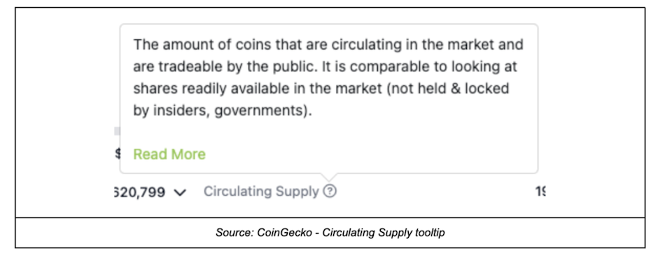
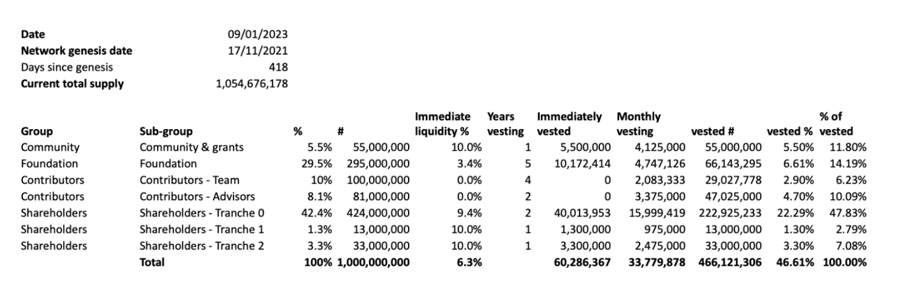

# Circulating Supply Explained

## cheqd Circulating Supply Explained

There are plenty of terms and metrics used to measure a project’s tokenomics, often with their own methodology for measuring certain aspects of them, which can cause plenty of confusion. This is further complicated by the fact that certain terms are accidentally used interchangeably or can have a different definition or interpretation depending on the user or reader of it.

“Circulating Supply” is a great example of this.

> **Circulating Supply** (CS) is defined by CoinGecko as: *"The amount of coins that are circulating in the market and are tradeable by the public."*

Below we have outlined a few different potential interpretations of Circulating Supply using different calculation methodologies:

| **Interpretation:**                   | **CoinGecko (CG) & CoinMarketCap (CMC)**                                                                                                                                                                                                                                                      | **Amended CG & CMC - (our preferred approach)**                                                                                                                                                       | **Maximum potential CS plus rewards minus internal account “vested” tokens**                                                                                                                                                            | **Maximum potential circulating supply**                                                                                                                                                                                                                            |
| ------------------------------------- | ----------------------------------------------------------------------------------------------------------------------------------------------------------------------------------------------------------------------------------------------------------------------------------------------------- | ----------------------------------------------------------------------------------------------------------------------------------------------------------------------------------------------------- | --------------------------------------------------------------------------------------------------------------------------------------------------------------------------------------------------------------------------------------- | ------------------------------------------------------------------------------------------------------------------------------------------------------------------------------------------------------------------------------------------------------------------- |
| Calculation methodology               | <ul><li>Total supply *minus* </li><li>Any balances held in following accounts:<ul><li>Private sale</li><li>Ecosystem / Bounty / Marketing / Operations / Airdrops</li><li>Masternodes / Staking</li><li>Team / Foundation / Treasury / Escrow</li></ul></li></ul> | <ul><li>CG & CMC methodology *plus* </li><li>Additional purchases, and</li><li>Staking rewards *minus*</li><li>Tokens burnt</li></ul> | <ul><li>Maximum potential circulating supply *minus*</li><li>“Vested” tokens in<ul><li>Foundation</li><li>Community & grants</li><li>Contributors - Team</li><li>Advisors</li></ul></li></ul> | <ul><li>Number of vested tokens *plus*</strong></em></li><li>New tokens generated by inflation *minus*</li><li>Vested tokens burnt (if any)</li></ul>                                                                 |
| _Calculation Date as at 9th Jan 2023_ |                                                                                                                                                                                                                                                                                                       |                                                                                                                                                                                                       |                                                                                                                                                                                                                                         |                                                                                                                                                                                                                                                                     |
| **$CHEQ**                             | **183,875,880**                                                                                                                                                                                                                                                                                       | **225,373,025**                                                                                                                                                                                       | **324,134,725**                                                                                                                                                                                                                         | **521,670,980**                                                                                                                                                                                                                                                     |
| % of total supply                     | 17.4%                                                                                                                                                                                                                                                                                                 | 21.4%                                                                                                                                                                                                 | 30.7%                                                                                                                                                                                                                                   | 49.5%                                                                                                                                                                                                                                                               |
| _Note_                                | _A private investor purchasing additional tokens off secondary markets erroneously reduces CS when it should have no impact._                                                                                                                                                                         | _This calculation fixes the issue created by the blunt approach adopted by CG and CMC._                                                                                                               | _These are all vested tokens but excluding any accounts that are internal or non-public accounts which are not expected to come onto the circulating supply in the same way as other accounts i.e. treasury, team, and advisors._       | _This shows the theoretical maximum circulating supply. \ \ For $CHEQ, this calculation works from the vesting schedules published in_ [_cheqd’s Tokenomics Part 2_](https://cheqd.io/blog/cheqds-tokenomics-for-ssi-explained-part-2)_, see full breakdown below._ |

## Simplified view

| _Calculation date: 9 Jan 2023_                                         |   | **#**       | **% of current total supply** |
| ---------------------------------------------------------------------- | - | ----------- | ----------------------------- |
| CG & CMC                                                               |   | 183,875,880 | 17.4%                         |
| Amended CG & CMC - (our preferred)                                     |   | 216,977,964 | 20.6%                         |
| Max potential CS _plus rewards minus internal account “vested” tokens_ |   | 324,134,725 | 30.7%                         |
| Maximum potential CS plus rewards                                      |   | 520,797,484 | 49.4%                         |

## Cosmos Auth Module

Token distribution is done programmatically based on [Cosmos' Vesting Accounts](https://docs.cosmos.network/v0.45/modules/auth/05\_vesting.html#vesting). Every vesting wallet receives their tokens at the outset but they are locked natively and automatically vest and unlock.

This explains why vested tokens are not automatically shown as Circulating Supply, since tokens are distributed in advance, they are automatically vested and unlocked, and are not moved between accounts. Here's an example to illustrate how it works.

Token holder

1. Receives 1 million tokens with a vesting period of 2 years into a Cosmos SDK genesis account
2. Can see their wallet with 1 million tokens but can't move tokens (no transfer/sell)
3. Tokens start vesting on a block-by-block basis (in the case of continuous vesting accounts)
4. Can stake or vote with their entire balance
5. Can only transact tokens once they are vested

## The reason we opted for this approach

We decided to distribute the tokens and automate its release as it is far more efficient, secure, and precise than the alternatives, e.g. there is no need for smart contracts which can be vulnerable, or manual distribution which is effort intensive and inefficient. We save our team precious time that can be better spent elsewhere, i.e. not spending days unlocking and transferring tokens.
