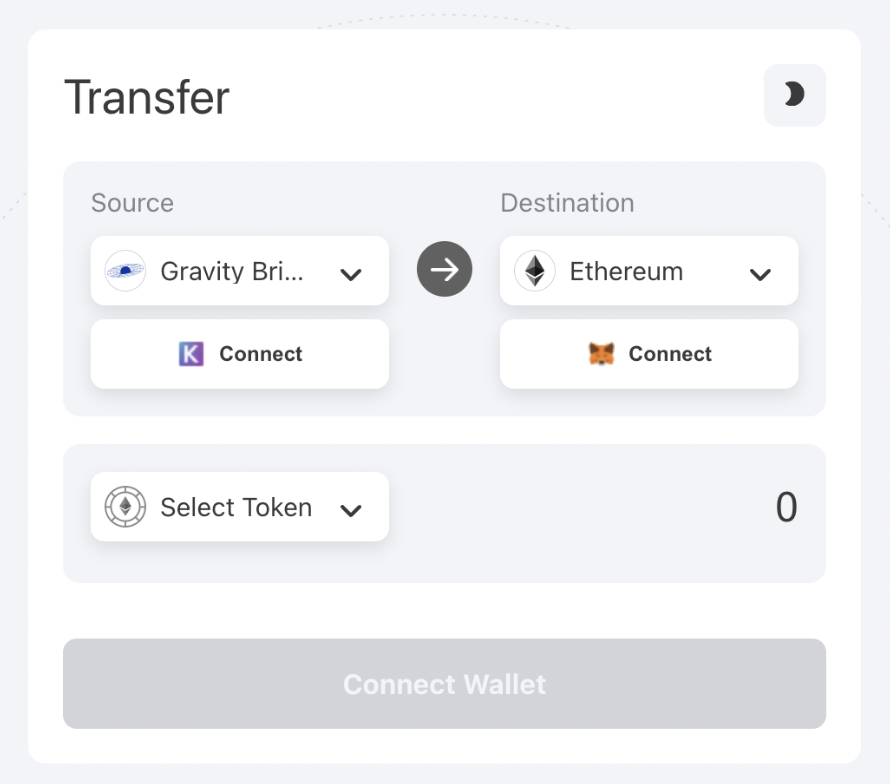
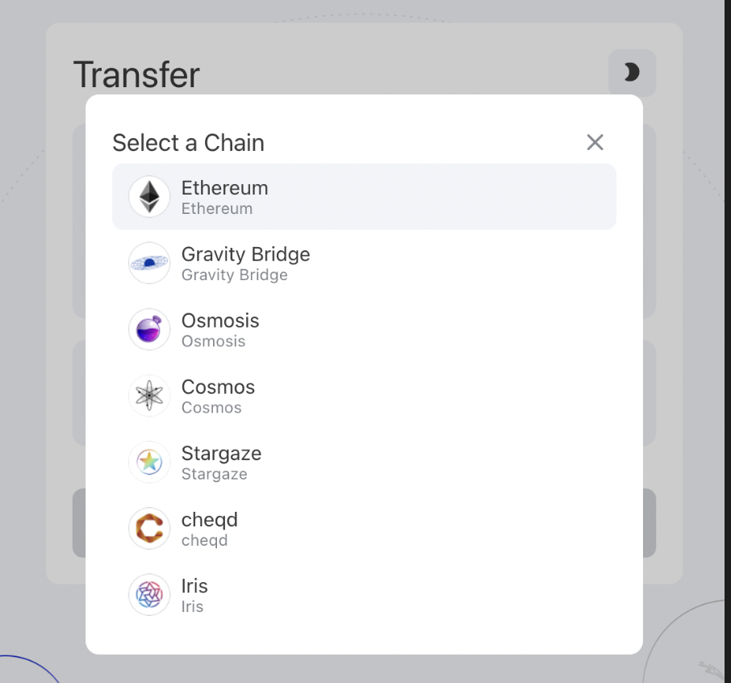
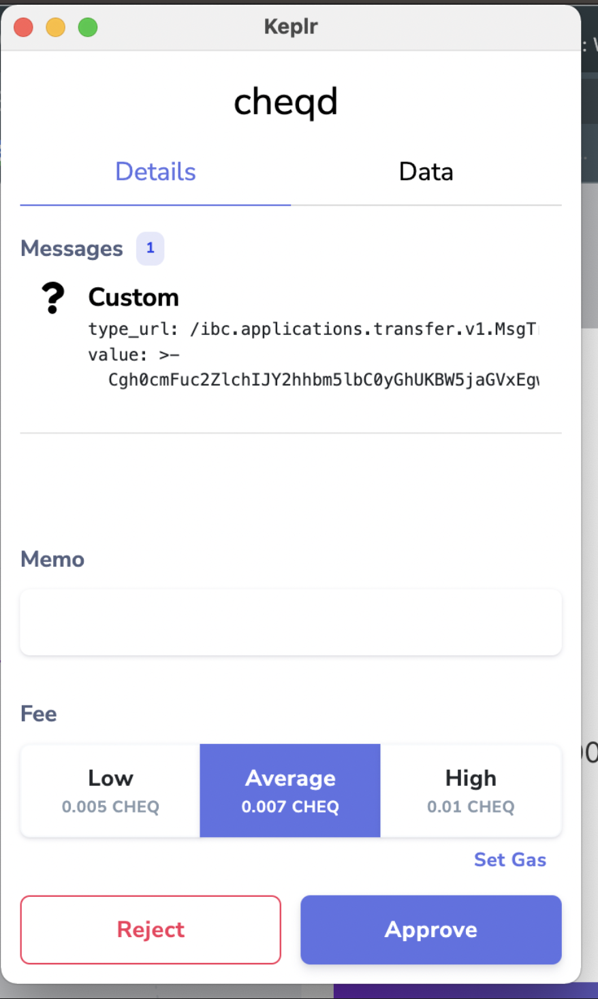
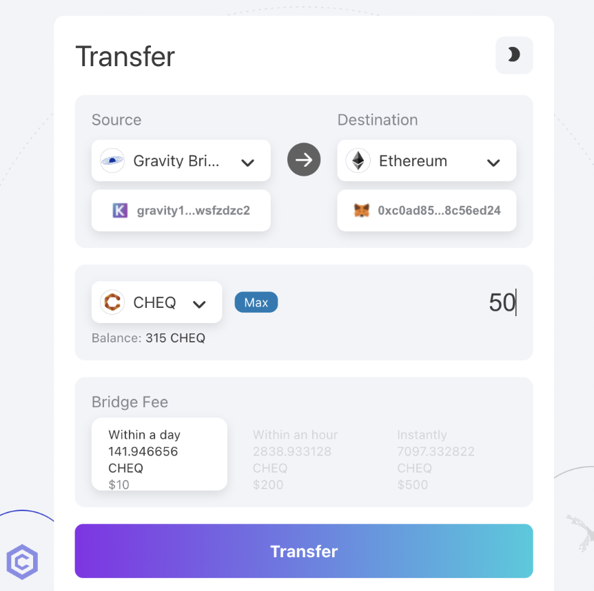
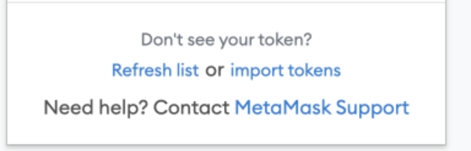
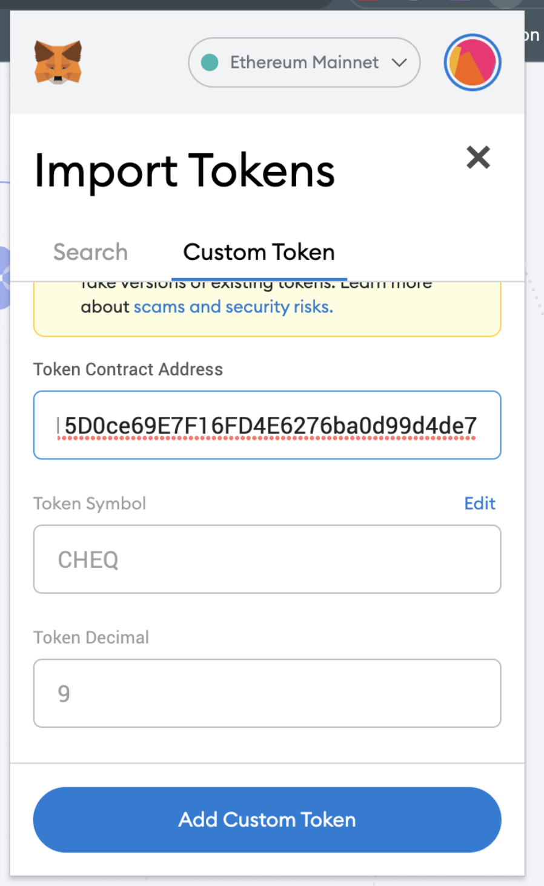

# How to send tokens to Ethereum with Gravity Bridge

## Context

This guide will provide the information you’ll need to make a transfer of tokens native to Cosmos, across to Ethereum and ultimately onto a Decentralised Exchange (DEX).

It has been constructed using another Cosmos project (StarGaze) as the token that is being transferred across using the Gravity Bridge.

The process follows 3 distinct parts:

### Part 1: Transfer CHEQ tokens to Gravity Bridge

In order to transfer tokens from Cosmos to Ethereum, the Gravity Bridge chain is required to hold the tokens you wish to transfer. Therefore, the first step is to send the tokens from the chain you are transferring from on Cosmos, to the Gravity Bridge, via IBC.

### Part 2: Transfer CHEQ tokens from to Ethereum

The Gravity Bridge then will be able to transfer the tokens across the bridge, locking them up on the Cosmos side, and minting them on the Ethereum side

### Part 3: Add the wrapped CHEQ token to your MetaMask wallet

Finally, if you'd like to interact with DEX's such as UniSwap you will be required to add the token to your MetaMask using a ‘Contract Address’, and then connect this to your UniSwap account.

The final section of the guide will provide instructions on how to complete this process in reverse (i.e. transferring tokens from Ethereum to Cosmos).

Let’s do it…

### Part 1: Transfer CHEQ tokens to Gravity Bridge from cheqd

The following instructions for this part use Spacestation itself for the IBC transfer of CHEQ tokens to the Gravity chain. You can however also do a direct IBC transfer within Keplr itself.&#x20;

#### Step 1: Connect Wallets

Go to [Spacestation](https://spacestation.zone/) on your browser which you use to access you [MetaMask](https://metamask.io/) and[Keplr wallets.](https://www.keplr.app/)

Connect your **Keplr** wallet containing the tokens you which to transfer.&#x20;

This will take you through the login process using the browser extensions for both wallets (don’t worry about which side if on Source and which Destination at this stage).

#### Step 2: Source Chain

Select the cheqd as the '**Source**' chain

#### Step 3: Destination Chain

Select the destination chain - this **MUST** be the Gravity Bridge chain.

#### Step 4: Select Token and Transfer&#x20;

Select the token you wish to transfer and enter the amount noting you'll need an additional amount to pay for gas fees.

A pop-up will appear which you'll need to approve for the transaction to go through.

### Part 2: Transfer CHEQ tokens from Gravity Bridge to Ethereum

#### Step 5: Select Source & Destination&#x20;

Select Gravity Bridge as the Source, and Ethereum as the Destination.&#x20;

Login to your [**MetaMask**](https://metamask.io/) wallet using the browser extension and connect.&#x20;

#### Step 6: Select your CHEQ tokens & Enter the amount you wish to transfer.&#x20;

The token you have sent to Gravity Bridge will now appear on the list within Gravity Bridge with the available amount listed. Enter the amount you wish to transfer.&#x20;

Note: The transaction fees are high due to the costs of transactions on the Ethereum side. You can select either a day, an hour or instant, at increasing costs.&#x20;

### Part 3: Add the CHEQ token to MetaMask & connect to UniSwap

Once you have completed the transfer you will need to wait for duration you have selected.&#x20;

#### Step 7: Add CHEQ to your MetaMask wallet&#x20;

During this time you can get started with adding CHEQ to your MetaMask wallet.&#x20;

Open your MetaMask wallet and select ‘import tokens’ at the bottom of the window

Select ‘**Custom Token**’ and enter the CHEQ '**Token Contract Address'.**&#x20;

CHEQ**:** `0x70EDF1c215D0ce69E7F16FD4E6276ba0d99d4de7`

Here are a selection of other Cosmos chains available thanks to the Gravity Bridge&#x20;

ATOM: `0xdaf0b40b961CA51Fc914fbabdA8E779619576caD` \
STARS: `0x4547254E6E3195cE57Bc50352193A25c2F4B8FCf` \
HUAHUA: `0x7bE48633D86AA9821284B01030b8a3F9B06eA876` \
NYM: `0x525A8F6F3Ba4752868cde25164382BfbaE3990e1` \
NYMT: `0xE8883BAeF3869e14E4823F46662e81D4F7d2A81F` \
PLA: `0xa752Ef191E8b103150D5FE4a6639A598Ede5a50F`

When entered this will automatically retrive the CHEQ token symbol and denomination (10^9 for CHEQ). CHEQ will now appear in your list of assets on the MetaMask homepage.&#x20;

Now you can wait for CHEQ tokens that have been sent via Gravity Bridge to appear in your MetaMask wallet.
