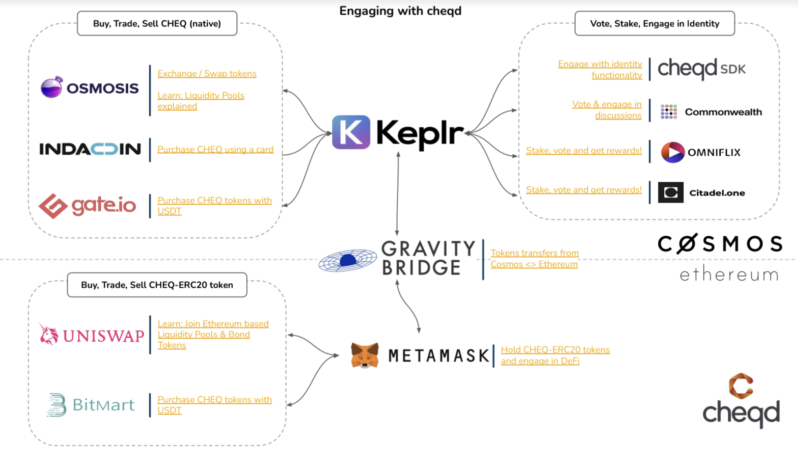

# 🔍 Where to find $CHEQ



{% embed url="https://www.bitmart.com/trade/en?%3Fr=Ppnxq3&layout=basic&symbol=CHEQ_USDT" %}







## Engaging with cheqd & $CHEQ


Open the PDF to use an interactive version of this slide to navigate to each page



